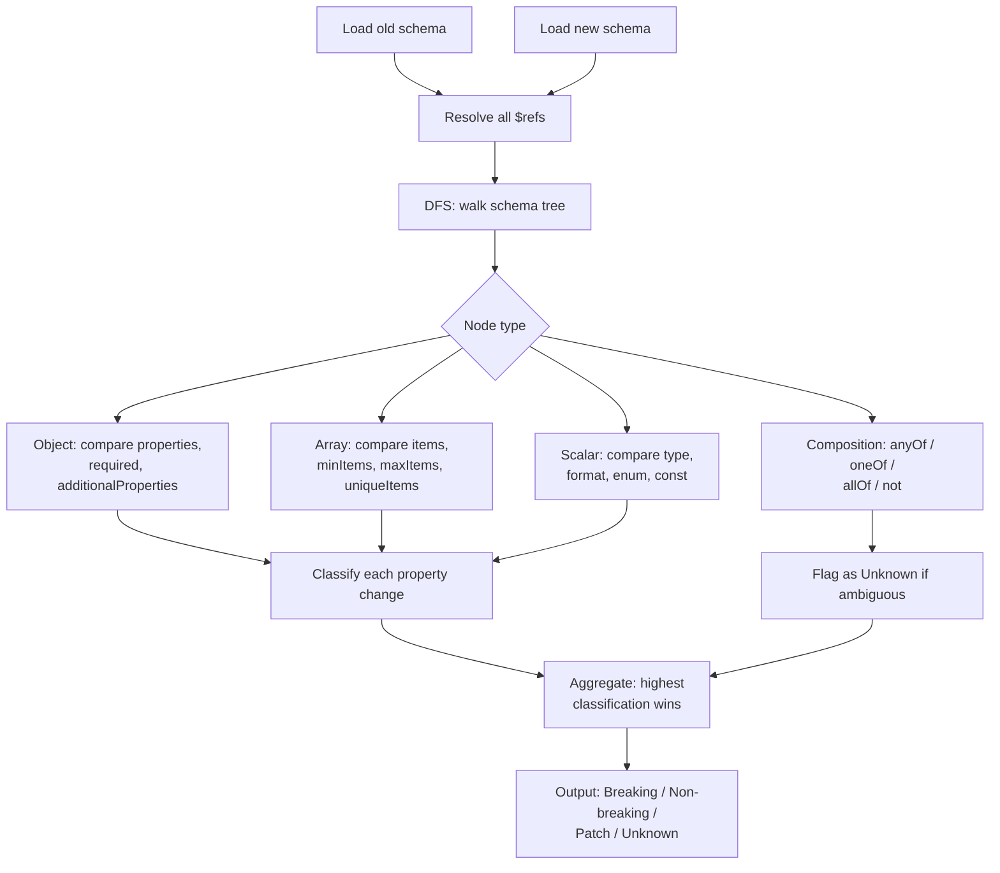
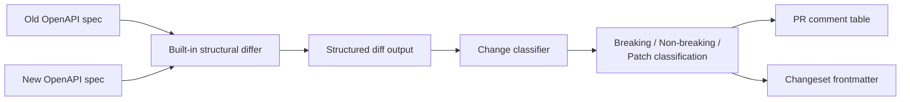

import { Aside, Badge } from '@astrojs/starlight/components';

Contractual detects breaking changes by structurally comparing two versions of a schema — not by diffing strings, not by diffing lines. It understands what a schema means and classifies changes by their impact on existing consumers.

This page explains the algorithm, the classification rules, and the edge cases you should know about.

---

## Approaches to detecting breaking changes

Teams use several strategies to catch breaking API and schema changes. Each operates at a different layer of the development lifecycle.

| Approach | How it works | Catches problems | Tradeoffs |
|---|---|---|---|
| **Code review** | Humans read the diff | Sometimes, if reviewer knows the schema | Misses structural implications |
| **Consumer-driven contracts (Pact)** | Consumers declare expectations, provider verifies | What's covered by tests | Requires org-wide adoption, Pact broker |
| **Schema packages** | Publish schemas as libraries, consumers test | Consumer-side only, after the fact | Doesn't prevent, just detects late |
| **Schema registry** | Registry rejects incompatible schemas at deploy/runtime | Structurally, with enforcement | Adds infrastructure, latency, runtime coupling |
| **Spec-level diffing in CI** | Diff schema structure in PRs | Structurally, at PR time | No runtime enforcement, no business-level semantics |

Contractual takes the last approach. These aren't competing — a team might use spec-level diffing in CI (early warning) alongside a schema registry (runtime enforcement).

---

## Structural diff vs string diff

When you run `git diff` on a schema file, you see which lines changed. That tells you nothing about whether the change is safe for consumers.

A structural differ reads both schemas into memory, normalizes them (resolving `$ref`, merging `allOf`, flattening defaults), and then compares the logical structure:

```
String diff sees:             Structural diff sees:

-  "type": "string"           Field "amount":
+  "type": "number"             type changed string → number
                                Classification: BREAKING
```

This matters because:

- Whitespace and formatting changes produce no structural diff
- Moving a `$ref` inline produces no structural diff
- Reordering `required` array entries produces no structural diff
- Changing a type produces a breaking diff regardless of how it looks in the file

---

## How the JSON Schema differ works

Contractual's JSON Schema differ performs a depth-first traversal of both schemas simultaneously. At each node it compares the old value to the new value and applies classification rules.



### Draft support

The differ targets **JSON Schema Draft-07** as its primary dialect. Draft-04 and Draft 2019-09 are partially supported. Draft 2020-12 support is planned.

If your schema uses draft-specific keywords that the differ does not recognise, those keywords are ignored (not flagged as breaking). Use `contractual lint` to catch unknown keywords before diffing.

---

## Classification rules

### Object properties

| Change | Classification | Reason |
|---|---|---|
| Property removed | <Badge text="Breaking" variant="danger" /> | Consumers reading this field will break |
| Property type changed (narrowed) | <Badge text="Breaking" variant="danger" /> | Values that were valid are no longer valid |
| Property type changed (widened) | <Badge text="Non-breaking" variant="tip" /> | All previously valid values remain valid |
| Required property added | <Badge text="Breaking" variant="danger" /> | Producers that omit this field now fail validation |
| Optional property added | <Badge text="Non-breaking" variant="tip" /> | Existing consumers unaffected |
| `additionalProperties: true` → `false` | <Badge text="Breaking" variant="danger" /> | Previously-valid extra fields now rejected |
| `additionalProperties: false` → `true` | <Badge text="Non-breaking" variant="tip" /> | More values now accepted |

### String constraints

| Change | Classification | Reason |
|---|---|---|
| `minLength` increased | <Badge text="Breaking" variant="danger" /> | Previously-valid short strings now rejected |
| `minLength` decreased or removed | <Badge text="Non-breaking" variant="tip" /> | More values now accepted |
| `maxLength` decreased | <Badge text="Breaking" variant="danger" /> | Previously-valid long strings now rejected |
| `maxLength` increased or removed | <Badge text="Non-breaking" variant="tip" /> | More values now accepted |
| `pattern` added | <Badge text="Breaking" variant="danger" /> | Strings not matching pattern now rejected |
| `pattern` removed | <Badge text="Non-breaking" variant="tip" /> | Previously-rejected strings now accepted |
| `pattern` changed | <Badge text="Breaking" variant="danger" /> | Cannot guarantee old valid strings still match |
| `format` added or changed | <Badge text="Breaking" variant="danger" /> | Stricter validation applied |
| `format` removed | <Badge text="Non-breaking" variant="tip" /> | Less strict |

### Numeric constraints

| Change | Classification | Reason |
|---|---|---|
| `minimum` / `exclusiveMinimum` increased | <Badge text="Breaking" variant="danger" /> | Previously-valid small values now rejected |
| `minimum` / `exclusiveMinimum` decreased or removed | <Badge text="Non-breaking" variant="tip" /> | More values now accepted |
| `maximum` / `exclusiveMaximum` decreased | <Badge text="Breaking" variant="danger" /> | Previously-valid large values now rejected |
| `maximum` / `exclusiveMaximum` increased or removed | <Badge text="Non-breaking" variant="tip" /> | More values now accepted |
| `multipleOf` added | <Badge text="Breaking" variant="danger" /> | Values not divisible by new factor now rejected |
| `multipleOf` removed | <Badge text="Non-breaking" variant="tip" /> | Previously-rejected values now accepted |
| `multipleOf` changed | <Badge text="Breaking" variant="danger" /> | Cannot guarantee all previously-valid values still pass |

### Enum and const

| Change | Classification | Reason |
|---|---|---|
| Enum value removed | <Badge text="Breaking" variant="danger" /> | Consumers using that value will fail validation |
| Enum value added | <Badge text="Non-breaking" variant="tip" /> | All existing values still valid |
| Enum replaced with `const` | <Badge text="Breaking" variant="danger" /> | All but one value now invalid |
| `const` value changed | <Badge text="Breaking" variant="danger" /> | The single allowed value changed |
| `const` removed, enum added | <Badge text="Non-breaking" variant="tip" /> | More values now accepted |

### Array constraints

| Change | Classification | Reason |
|---|---|---|
| `items` schema type narrowed | <Badge text="Breaking" variant="danger" /> | Previously-valid items now rejected |
| `items` schema type widened | <Badge text="Non-breaking" variant="tip" /> | All previously-valid items still valid |
| `minItems` increased | <Badge text="Breaking" variant="danger" /> | Arrays shorter than new minimum now rejected |
| `minItems` decreased or removed | <Badge text="Non-breaking" variant="tip" /> | More arrays now accepted |
| `maxItems` decreased | <Badge text="Breaking" variant="danger" /> | Arrays longer than new maximum now rejected |
| `maxItems` increased or removed | <Badge text="Non-breaking" variant="tip" /> | More arrays now accepted |
| `uniqueItems: false` → `true` | <Badge text="Breaking" variant="danger" /> | Arrays with duplicate items now rejected |
| `uniqueItems: true` → `false` | <Badge text="Non-breaking" variant="tip" /> | More arrays now accepted |

### Metadata-only changes

| Change | Classification | Reason |
|---|---|---|
| `title` changed | <Badge text="Patch" variant="note" /> | No validation impact |
| `description` changed | <Badge text="Patch" variant="note" /> | No validation impact |
| `examples` changed | <Badge text="Patch" variant="note" /> | No validation impact |
| `default` changed | <Badge text="Patch" variant="note" /> | Informational only (not enforced by validators) |
| `$comment` changed | <Badge text="Patch" variant="note" /> | No validation impact |

---

## The "Unknown" category

Composition keywords (`anyOf`, `oneOf`, `not`) are set-theoretic. Determining whether a change to a composition is breaking requires computing the intersection of accepted value sets — a problem that is undecidable in the general case.

When Contractual encounters a change inside a composition, it flags it as **Unknown** and asks for human review:

```bash
$ contractual breaking

  orders-api  1 unknown change requires review

  UNKNOWN  orders-api: anyOf[1].properties.status — composition changed
           Cannot determine if this is breaking. Review manually.
```

An Unknown classification does not fail the CI check by default, but it does appear in the PR comment and generates a changeset entry at the `major` level (conservative by default). You can override this in the changeset frontmatter after review.

<Aside type="caution">
If your schema relies heavily on `anyOf` or `oneOf`, expect more Unknown classifications. Consider restructuring to use `oneOf` with discriminator properties, which are easier for tooling to reason about.
</Aside>

---

## OpenAPI structural diffing

For OpenAPI contracts, Contractual uses a built-in Node-native structural differ that operates at the HTTP operation level — not just the schema level — covering:

- Endpoint additions and removals
- HTTP method additions and removals
- Path and query parameter changes
- Request body schema changes
- Response schema changes
- Authentication requirement changes
- Server URL changes

The built-in differ computes a structured diff and classifies changes according to the same rules used for JSON Schema diffing, providing a unified view in the PR comment.



You can replace the built-in differ with a custom one if you need different behavior. See [Custom Linters and Differs](/guides/custom-governance).

---

## Edge cases

### $ref resolution

Before diffing, Contractual resolves all `$ref` pointers in both schemas. This means:

- A change to a shared `$ref` definition propagates to every location that uses it
- Moving a type definition from inline to a `$ref` (or vice versa) does not produce a diff if the resulting schema is identical
- Circular `$ref` chains are detected and handled (the recursive portion is not traversed more than once)

### Nested objects

The differ recurses into nested objects to any depth. A breaking change to a property of a property of a property is still classified as breaking and reported with its full path:

```
BREAKING  orders-api: properties.customer.properties.address.properties.zip
          type changed: string → integer
```

### Array items

Changes to `items` are treated as changes to the schema of every element in an array. If `items.type` changes from `string` to `number`, any array containing strings is now invalid — classified as breaking.

If `items` changes from a single schema to an array of schemas (tuple validation), Contractual flags this as breaking because the positional semantics changed.

### allOf merging

`allOf` schemas are merged before diffing. If you add a new `allOf` entry that makes a property required, the differ sees a required field added — classified as breaking — regardless of where in the `allOf` structure the addition appears.

---

## Classification-to-semver mapping

| Classification | Semver bump |
|---|---|
| Breaking | major |
| Non-breaking | minor |
| Patch | patch |
| Unknown | major (conservative default, override with changeset edit) |

The highest bump across all changes in a changeset wins. If a PR has both breaking and non-breaking changes, the contract gets a `major` bump.

---

## Where to go next

- See the complete classification reference table: [Change Classifications](/reference/change-classifications)
- Understand how classifications become changeset entries: [The Changeset Model](/concepts/changesets)
- Configure a custom differ for your contract: [Custom Linters and Differs](/guides/custom-governance)
- Read the full system mental model: [How Contractual Works](/concepts/how-it-works)

---

## Related work

The JSON Schema organization is working on official compatibility tooling ([GSoC #984](https://github.com/json-schema-org/community/issues/984)). If and when an official package ships, Contractual may adopt it as a dependency.
