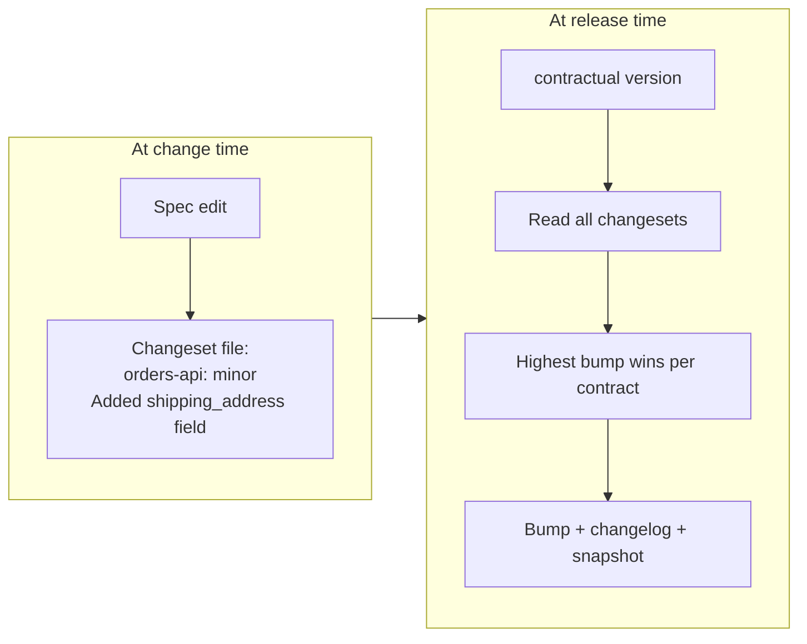
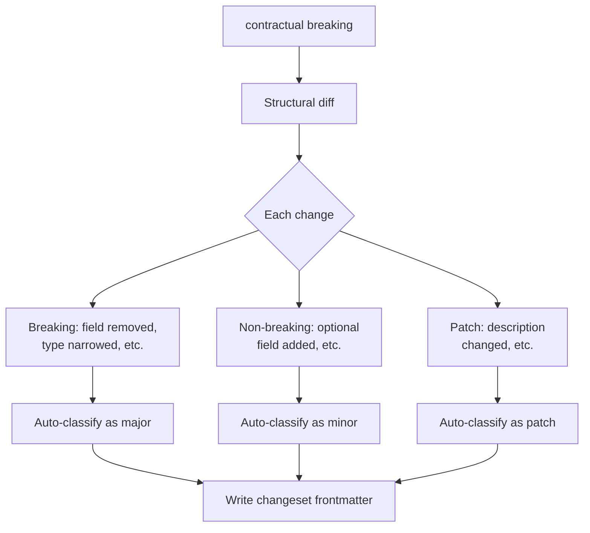

import { Aside, Card, CardGrid } from '@astrojs/starlight/components';

A changeset is a small markdown file that records which contracts are changing and at what semver severity. Contractual generates them automatically. You review and optionally edit them. The release step consumes them.

This page explains the model, what a changeset looks like, and why it outperforms the alternatives.

---

## The core insight

Most versioning systems answer "what version should this be?" at the moment of release. That creates two problems:

1. **You've lost context.** The person releasing may not be the person who made the change. The commit message is gone. The intent is unclear.
2. **You can't batch.** Each release must be decided independently. Multiple changes to multiple contracts require multiple manual decisions.

Changesets flip the model: **the person who makes the change declares its severity at the time they make it.** The release step simply adds up the declarations.



---

## What a changeset file looks like

Changeset files live in `.contractual/changesets/`. Each file has a name like `fuzzy-tiger-runs.md` (adjective-noun-verb). The format is YAML frontmatter plus a markdown body:

```markdown
---
"orders-api": minor
"order-schema": patch
---

## orders-api

Added optional `shipping_address` field to the Order object. Existing consumers
are unaffected — the field is not required and has a default of `null`.

## order-schema

Updated description of the `amount` field to clarify it represents cents, not dollars.
```

The frontmatter declares the semver level for each affected contract. The body is freeform markdown that becomes the changelog entry.

<Aside type="note">
When Contractual auto-generates a changeset, the body contains the detected changes. You can edit it before merging. Your edits flow into the published changelog.
</Aside>

### Frontmatter keys

| Key | Value | Meaning |
|---|---|---|
| `"contract-name"` | `major` | Breaking change — bump major version |
| `"contract-name"` | `minor` | Non-breaking addition — bump minor version |
| `"contract-name"` | `patch` | Metadata-only change — bump patch version |

A single changeset can reference multiple contracts at different severity levels.

### Naming convention

Contractual generates adjective-noun-verb names (`fuzzy-tiger-runs`, `bright-stone-falls`) to make changesets easy to identify in Git history without collisions. You can rename them if you prefer, but the name has no semantic meaning — only the frontmatter content matters.

---

## Why changesets beat the alternatives

### Conventional Commits

Conventional Commits encode the bump intent in the commit message (`feat:`, `fix:`, `BREAKING CHANGE:`). This works well for single packages. It breaks down for contracts:

| Problem | Conventional Commits | Changesets |
|---|---|---|
| Multiple contracts in one commit | No way to say "feat for orders-api, fix for order-schema" | Frontmatter supports multiple contracts |
| Batching releases | Every commit is a release decision | Changesets accumulate; release when ready |
| Human-readable changelog | Tools generate from commit messages | Body is already human-readable markdown |
| Non-code changes | Commit history is the only record | Changeset file is an explicit artifact |

### Manual versioning

Manually editing `versions.json` or `package.json` before each release:

- Forgotten when developers are moving fast
- No enforced changelog entry
- No structural check that the declared severity matches actual changes
- Breaks in monorepos with many contracts

### Tag-based versioning

Tagging commits (`v1.2.0`) with no intermediary step:

- No way to accumulate changes across multiple PRs
- No changelog without additional tooling
- No way to batch releases across contracts
- No connection between the tag and specific structural changes

---

## How Contractual extends the changeset model

The original Changesets library (for npm packages) is deliberately blind to what changed — it trusts the human to declare the right bump. That works for code packages where "breaking" is subjective.

Schemas are different. Contractual can structurally diff two schema versions and classify changes automatically.



Contractual auto-generates the changeset frontmatter from detected changes. You get the best of both worlds:

- **Machine accuracy** for unambiguous changes (field removal is always breaking)
- **Human judgment** for context (a major change in a pre-1.0 contract might be minor in practice)

### The override mechanism

Every auto-generated changeset can be edited before the PR merges. If Contractual classifies a change as `major` but you know it's safe, change the frontmatter:

```markdown
---
"orders-api": minor   # was: major — field removed but no consumers use it
---
```

The body should document why the override is appropriate. This becomes part of the changelog and your audit trail.

<Aside type="caution">
Override with care. Downgrading a breaking change to minor or patch means consumers will not receive a major version signal. Document your reasoning in the changeset body.
</Aside>

---

## Multiple changesets per contract

When multiple PRs modify the same contract before a release, each generates its own changeset. At release time, `contractual version` picks the highest bump declared across all changesets:

```
.contractual/changesets/
  fuzzy-tiger-runs.md     → orders-api: minor
  bright-stone-falls.md   → orders-api: major
  calm-river-flows.md     → orders-api: patch
```

Result: `orders-api` gets a `major` bump. All three changeset bodies are concatenated into a single changelog entry.

<Aside type="tip">
You can merge as many spec-change PRs as you like before merging the Version Contracts PR. Contractual accumulates all pending changesets into a single coherent release.
</Aside>

---

## Creating a changeset manually

If you make a non-spec change that still deserves a version bump (updating a description, retiring a deprecated field), create a changeset manually:

```bash
contractual changeset
```

This opens an interactive prompt asking which contracts are affected and at what level. Or skip the prompt with flags:

```bash
contractual changeset --contract orders-api --bump minor --message "Clarified amount field semantics"
```

See [contractual changeset](/reference/cli/changeset) for the full command reference.

---

## Where to go next

- See how Contractual classifies changes structurally: [Breaking Change Detection](/concepts/breaking-changes)
- Understand the full versioning workflow: [Managing Versions](/guides/versioning)
- Read the changeset file format spec: [Changeset File Format](/reference/changeset-format)
- See the two-PR release pattern: [How Contractual Works](/concepts/how-it-works)
