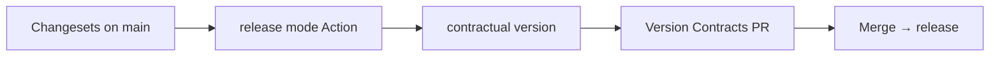

import { Aside, LinkCard, CardGrid } from '@astrojs/starlight/components';

This glossary defines the terms you will encounter in Contractual's docs, CLI output, PR comments, and changeset files. Terms that appear elsewhere in the docs link to their full explanation.

---

## Bump

A semver version increment. Contractual recognises three bump levels:

| Level | When applied | Example |
|---|---|---|
| `major` | Breaking change detected | `1.2.3` → `2.0.0` |
| `minor` | Non-breaking change detected | `1.2.3` → `1.3.0` |
| `patch` | Metadata-only change | `1.2.3` → `1.2.4` |

When multiple changesets affect the same contract, the highest bump level wins. A contract with one `minor` changeset and one `major` changeset receives a `major` bump.

See [Managing Versions](/guides/versioning) for the full versioning workflow.

---

## Breaking change

A structural change to a contract that could cause existing consumers to fail — without any change to the consumer's own code.

Examples:
- Removing a field that consumers read
- Adding a required field that producers must now supply
- Narrowing a type (for example, `string` → `enum` with a fixed set of values)
- Removing an enum value that consumers may be sending

Contractual classifies breaking changes automatically using its [structural differ](/concepts/breaking-changes). Breaking changes map to a `major` bump.

<Aside type="caution">
"Breaking" is defined from the consumer's perspective. A change that is safe for your internal services may still be breaking for external consumers. Consider your audience when reviewing auto-detected classifications.
</Aside>

---

## Changeset

A markdown file that declares which [contracts](#contract) are changing and at what semver level. Changeset files live in `.contractual/changesets/`.

A changeset has two parts:

1. **Frontmatter** — YAML that maps contract names to bump levels
2. **Body** — Freeform markdown that becomes the changelog entry

```markdown
---
"orders-api": minor
"order-schema": patch
---

## orders-api

Added optional `shipping_address` field to the Order object.

## order-schema

Updated description of the `amount` field.
```

Contractual auto-generates changeset files during `pr-check` mode. You can edit them before merging. The `contractual version` command consumes changesets and deletes them.

See [The Changeset Model](/concepts/changesets) for a full explanation, and [Changeset File Format](/reference/changeset-format) for the format specification.

---

## Contract

A schema file managed by Contractual. A contract can be:

- An OpenAPI specification (YAML or JSON)
- A JSON Schema document
- An AsyncAPI document (coming soon)
- An ODCS schema (coming soon)

Each contract is declared in `contractual.yaml` with a name, type, and path to the spec file:

```yaml
contracts:
  - name: orders-api
    type: openapi
    spec: ./specs/orders.openapi.yaml
```

The `name` is used in changeset frontmatter, version history, CLI output, and PR comments. It must be unique within your configuration and formatted as a lowercase slug.

---

## Governance

The validation process that runs on every contract before a release or on every PR. Governance has two components:

1. **Lint** — Validates the contract against its schema rules (for example, Redocly CLI for OpenAPI, ajv for JSON Schema)
2. **Breaking check** — Structurally diffs the contract against its [snapshot](#snapshot) to detect breaking changes

Both components are configurable. You can override the default linter or differ, or disable either component for a specific contract. See [Custom Linters and Differs](/guides/custom-governance).

---

## Non-breaking change

A structural change to a contract that is backward-compatible. Existing consumers continue to work without modification.

Examples:
- Adding an optional field
- Loosening a constraint (for example, reducing `minLength`)
- Adding a new enum value
- Widening a type

Non-breaking changes map to a `minor` bump. Contractual classifies these automatically. See [Breaking Change Detection](/concepts/breaking-changes) for the full classification table.

---

## Patch change

A metadata-only change to a contract that has no effect on validation or consumer behavior.

Examples:
- Updating a field description
- Adding or changing an example
- Updating a title
- Changing a `$comment`

Patch changes map to a `patch` bump. They require a changeset if you want them to appear in the changelog; otherwise they can be released without a version bump.

---

## Snapshot

A copy of a contract at a specific version, stored in `.contractual/snapshots/`. Snapshots serve as the baseline for breaking change detection.

When `contractual version` runs, it copies the current spec file into the snapshots directory at the new version number. When `contractual breaking` runs on a future PR, it diffs the current spec against the snapshot — not against the live spec file.

```
.contractual/
  snapshots/
    orders-api/
      1.0.0.yaml    ← snapshot created when orders-api was at 1.0.0
      1.1.0.yaml    ← snapshot created when bumped to 1.1.0
```

<Aside type="note">
Snapshots are committed to your repository. Do not add them to `.gitignore`. They are the authoritative record of what each version of a contract contained.
</Aside>

---

## Version Contracts PR

The pull request that Contractual's GitHub Action opens automatically after detecting unconsumed changesets on the main branch.

The Version Contracts PR contains:
- Bumped version numbers in `.contractual/versions.json`
- Updated or newly created snapshots for each bumped contract
- Deleted changeset files (they are consumed)
- Updated `CHANGELOG.md` entries for each contract

Merging the Version Contracts PR is the release step. Nothing is published until you merge it.



The PR title, branch name, and labels are configurable in the GitHub Action inputs. See [GitHub Action Setup](/guides/github-action).

---

## Related pages

<CardGrid>
  <LinkCard
    title="How Contractual Works"
    description="The mental model for all three artifacts and the core flow."
    href="/concepts/how-it-works"
  />
  <LinkCard
    title="The Changeset Model"
    description="How changesets decouple change time from release time."
    href="/concepts/changesets"
  />
  <LinkCard
    title="Breaking Change Detection"
    description="The structural diff algorithm and full classification table."
    href="/concepts/breaking-changes"
  />
  <LinkCard
    title="Changeset File Format"
    description="Complete specification for .contractual/changesets/*.md files."
    href="/reference/changeset-format"
  />
</CardGrid>
