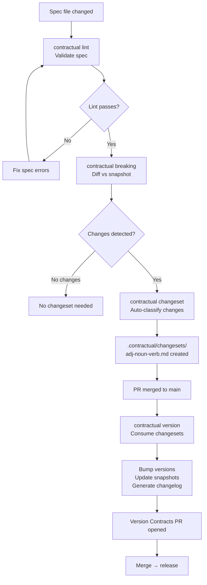
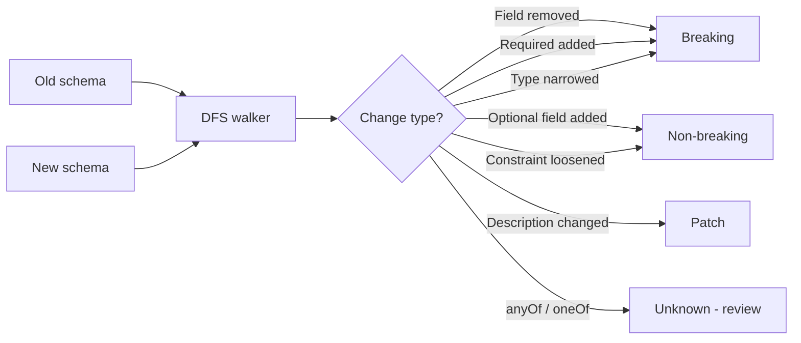
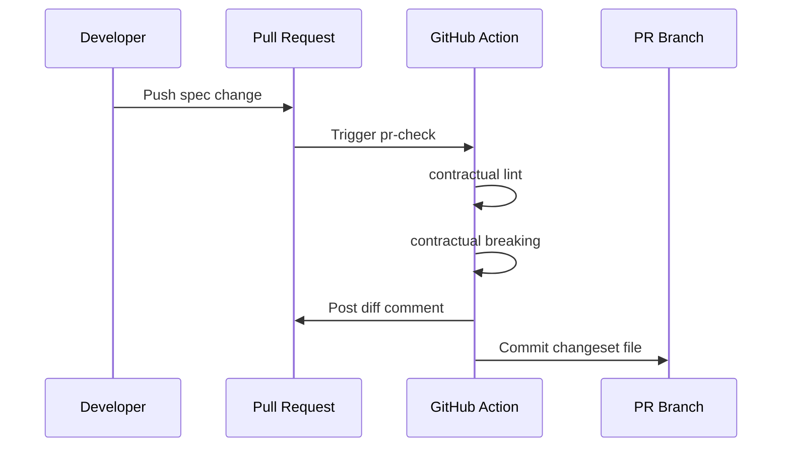
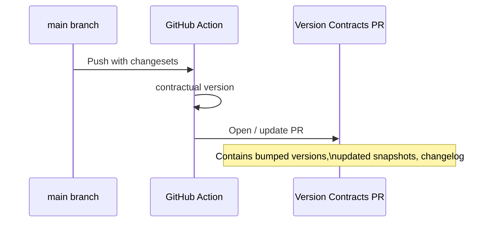
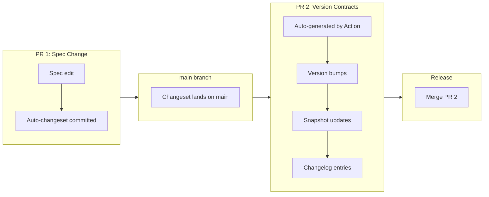

import { Aside, Card, CardGrid } from '@astrojs/starlight/components';

Contractual is a thin coordination layer over tools you already know. It detects breaking changes, manages changesets, and bumps versions — without replacing your linter, your differ, or your release process.

This page builds the mental model you need to understand every other part of the docs.

---

## The three artifacts

Every Contractual setup consists of exactly three things:

<CardGrid>
  <Card title="npm package (CLI)" icon="laptop">
    The `contractual` CLI. Runs locally and in CI. Wraps Spectral, Redocly, ajv, and includes built-in structural differs. Install it once, use it everywhere.
  </Card>
  <Card title="GitHub Action" icon="github">
    `contractual-dev/contractual@v1`. Runs in two modes: `pr-check` (on pull request open/sync) and `release` (on push to main). Posts PR comments and opens the Version Contracts PR.
  </Card>
  <Card title=".contractual/ directory" icon="open-book">
    Lives in your repository. Contains snapshots, changesets, versions, and changelog. This is the source of truth for your contract history — commit it like code.
  </Card>
</CardGrid>

---

## The core flow

Every change to a spec follows the same path from edit to release:



Each step maps to a CLI command. The GitHub Action runs `lint` and `breaking` automatically on every PR, then creates the changeset for you.

---

## Contractual wraps, not reinvents

Contractual does not build its own linter or OpenAPI differ. It delegates to the best available tool for each format:

| Format | Default linter | Default differ |
|---|---|---|
| OpenAPI | Redocly CLI | Built-in structural differ |
| JSON Schema | ajv (meta-validation) | Built-in structural differ |
| AsyncAPI | @asyncapi/parser | Built-in (coming soon) |
| ODCS | ajv vs ODCS schema | Built-in (coming soon) |

When Contractual runs `contractual lint`, it shells out to the configured linter. When it runs `contractual breaking`, it shells out to the configured differ — or uses the built-in one for JSON Schema.

You can override both for any contract:

```yaml
contracts:
  - name: orders-api
    type: openapi
    spec: ./specs/orders.openapi.yaml
    governance:
      lint: "spectral lint {spec} --format json"
      breaking: "my-custom-differ {old} {new} --output json"
```

See [Custom Linters and Differs](/guides/custom-governance) for details.

---

## The one thing built from scratch

The JSON Schema structural differ is the only tool Contractual builds itself. No production-quality breaking change detection existed for JSON Schema before Contractual.

The differ walks two schemas using a depth-first traversal of the schema tree, classifying each change as breaking, non-breaking, or patch:



See [Breaking Change Detection](/concepts/breaking-changes) for the full classification table and algorithm details.

---

## GitHub Action modes

The GitHub Action operates in two modes, configured by the `mode` input:

### pr-check mode

Runs on `pull_request` events. Does the following:

1. Checks out the PR branch
2. Runs `contractual lint` — fails the check if any contract is invalid
3. Runs `contractual breaking` — diffs each contract against its snapshot
4. Posts a PR comment with the full diff table (breaking changes highlighted)
5. Auto-commits a changeset file to the PR branch



### release mode

Runs on `push` to main. Does the following:

1. Checks for unconsumed changesets in `.contractual/changesets/`
2. If changesets exist, runs `contractual version`
3. Opens (or updates) the "Version Contracts" PR



---

## The two-PR dance

Contractual uses a deliberate two-step release pattern:



**Why two PRs?** The spec change PR is about the change itself. The Version Contracts PR is about releasing it. Keeping them separate lets you:

- Batch multiple spec changes before releasing
- Review the cumulative version impact before it ships
- Roll back a release without touching spec history

<Aside type="tip">
You can merge multiple spec-change PRs before merging the Version Contracts PR. Contractual batches all pending changesets into a single version bump per contract.
</Aside>

---

## Where to go next

- Understand the changeset file format: [The Changeset Model](/concepts/changesets)
- Deep-dive into structural diffing: [Breaking Change Detection](/concepts/breaking-changes)
- Set up the GitHub Action: [GitHub Action Setup](/guides/github-action)
- Run your first breaking change check: [Quick Start: CLI](/getting-started/quickstart-cli)
