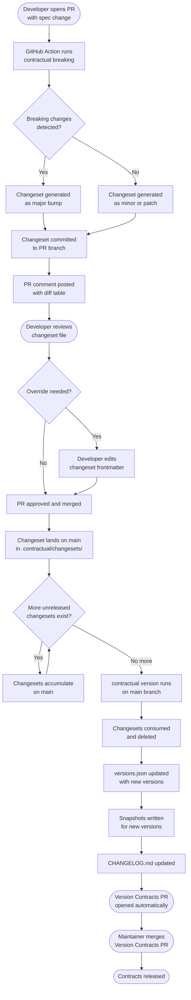

import { Aside, Code } from '@astrojs/starlight/components';

Contractual's versioning model is adapted from [Changesets](https://github.com/changesets/changesets). The core idea: decouple the moment a spec changes from the moment a version is released. This lets you batch multiple changes across multiple contracts into a single, deliberate release.

## The `.contractual/` directory

Running `contractual init` creates this directory at your repo root and commits it. Every file inside should be committed — it is the source of truth for contract versions and history.

```
.contractual/
├── versions.json              # Current semver version for every contract
├── changesets/                # One markdown file per unreleased change
│   ├── fuzzy-lion-dances.md
│   └── silver-hawk-runs.md
└── snapshots/                 # Point-in-time copies of each spec
    ├── orders-api/
    │   ├── 1.0.0.yaml
    │   └── 1.1.0.yaml
    └── order-schema/
        ├── 1.0.0.json
        └── 1.1.0.json
```

| Path | Purpose |
|---|---|
| `versions.json` | The canonical version for every contract. Updated by `contractual version`. |
| `changesets/` | Markdown files describing unreleased changes. Created automatically on PR, or manually. Consumed and deleted by `contractual version`. |
| `snapshots/` | Immutable copies of a spec at a released version. Used as the baseline when detecting breaking changes. |

## `versions.json` format

```json
{
  "orders-api": "1.2.0",
  "order-schema": "2.0.1",
  "events": "0.3.0"
}
```

Each key is a contract `name` from `contractual.yaml`. Each value is the last released semver version. When you add a new contract, `contractual init` (or the first `contractual version` run) adds it here at `0.0.0`.

`versions.json` is updated atomically by `contractual version` — never edit it manually unless you are establishing a baseline for an existing project. See the [migration recipe](/recipes/migration) if you are starting with existing specs.

## Snapshots

A snapshot is a verbatim copy of a spec file at a specific released version. Contractual stores them at `.contractual/snapshots/{name}/{version}.{ext}`.

Snapshots serve one purpose: they are the `{old}` side of every breaking change diff. When you run `contractual breaking`, Contractual compares the current spec file against the snapshot for the latest released version. Without a snapshot, there is no baseline to compare against and breaking change detection cannot run.

<Aside type="note">
Snapshots are created by `contractual version` at the moment a new version is released. The very first snapshot is created when you first run `contractual version` after `contractual init`.
</Aside>

Snapshots are immutable once written. If you need to correct a released version, use a new version release rather than editing the snapshot.

## Changeset lifecycle

The diagram below shows the full lifecycle of a changeset — from spec change to released version:



### Step by step

**1. PR opened with a spec change**

The GitHub Action's `pr-check` mode runs automatically. It calls `contractual breaking` to compare the modified spec against the latest snapshot.

**2. Changeset generated**

Based on the detected changes, Contractual creates a changeset file in `.contractual/changesets/` and commits it to the PR branch. The file name is a random adjective-noun-verb slug (for example, `fuzzy-lion-dances.md`).

**3. Developer reviews the changeset**

The PR comment shows a diff table. The committed changeset file shows the auto-detected bump level. If the developer disagrees with the classification (for example, Contractual detected a minor change but the team considers it breaking), they edit the changeset frontmatter directly on the branch.

**4. PR merges**

The changeset file lands on main inside `.contractual/changesets/`. The spec change and the changeset describing it travel together.

**5. `contractual version` runs**

The GitHub Action's `release` mode watches for changesets on main. When it finds them, it runs `contractual version`, which:

1. Reads all changeset files in `.contractual/changesets/`
2. Determines the highest bump level per contract
3. Updates `versions.json` with new version numbers
4. Writes new snapshots to `.contractual/snapshots/`
5. Appends entries to `CHANGELOG.md`
6. Deletes the consumed changeset files

**6. Version Contracts PR opened**

The GitHub Action opens a pull request titled "Version Contracts" containing all the version bumps, new snapshots, updated changelog, and removed changesets. Merging this PR is the release.

## Multiple changesets: highest bump wins

If three changesets land on main before `contractual version` runs, Contractual takes the highest bump across all of them for each contract:

```
fuzzy-lion-dances.md:   orders-api: minor
silver-hawk-runs.md:    orders-api: patch, order-schema: minor
brave-wolf-leaps.md:    orders-api: major
```

Result: `orders-api` gets a `major` bump. `order-schema` gets a `minor` bump. A single version release handles all three changesets.

## Manual changeset creation

You do not always need the GitHub Action to create changesets. Run this locally to open an interactive prompt:

```bash
contractual changeset
```

Or skip the prompt and specify everything inline:

```bash
contractual changeset --contract orders-api --bump minor --message "Added optional shipping_address field"
```

This creates a changeset file in `.contractual/changesets/`. Commit it and push it with your spec change.

The changeset file looks like this:

```markdown
---
"orders-api": minor
---

Added optional `shipping_address` field to the Order response object.
Existing consumers are unaffected — the field is not required and
has a default of `null`.
```

See [Changeset File Format](/reference/changeset-format) for the complete format reference.

## Overriding auto-detected classifications

Contractual classifies changes structurally — it can tell that removing a field is breaking and that adding an optional field is non-breaking. But structural analysis has limits. You know your consumers better than the tool does.

To override a classification, open the changeset file and edit the bump level in the frontmatter:

```markdown
---
"orders-api": major    ← change minor → major here
---

Renamed field `customerId` to `customer_id`. While structurally non-breaking
(both fields exist during the transition), all consumers must update
their integration before the old field is removed in the next release.
```

Valid values: `major`, `minor`, `patch`.

<Aside type="tip">
You can also update the markdown body to give consumers better context about why the classification was overridden. This text appears in `CHANGELOG.md` and in the PR comment.
</Aside>

## Next steps

- [Configuration](/guides/configuration) — `publish` section controls what `contractual version` does after bumping
- [GitHub Action Setup](/guides/github-action) — how the Action automates the changeset and release workflow
- [Changeset File Format](/reference/changeset-format) — complete format reference for `.contractual/changesets/*.md`
- [The Changeset Model](/concepts/changesets) — conceptual explanation of why this model works
