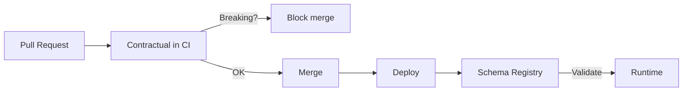

import { Aside, Tabs, TabItem } from '@astrojs/starlight/components';

Event schemas evolve. A field gets removed, a required property appears, an enum value is renamed — and downstream consumers break silently. In event-driven systems this is especially painful because consumers are often decoupled services you do not control, and there is no HTTP 422 to surface the mismatch at request time.

Common governance strategies layer on top of each other:

| Layer | When it catches a problem |
|---|---|
| Consumer-driven contract tests | At test time, if the consumer has tests and runs them |
| Schema registry validation | At runtime, when a message is produced or consumed |
| Spec-level diffing in CI | At the pull request, before any code ships |

This recipe covers the third layer. Contractual compares your event schema against its last-known-good snapshot and classifies every change as breaking or non-breaking before the pull request merges. The other layers still matter — this one catches problems earliest.

## AsyncAPI event schema

Use the `asyncapi` contract type for teams already writing AsyncAPI documents to describe their event channels, operations, and message payloads.

### Configure the contract

```yaml
# contractual.yaml
contracts:
  - name: order-events
    type: asyncapi
    path: ./events/orders.asyncapi.yaml
```

### Example AsyncAPI document

```yaml
# events/orders.asyncapi.yaml
asyncapi: "3.0.0"
info:
  title: Order Events
  version: "1.2.0"

channels:
  order/created:
    messages:
      OrderCreated:
        $ref: "#/components/messages/OrderCreated"

components:
  messages:
    OrderCreated:
      payload:
        type: object
        required:
          - orderId
          - customerId
          - totalAmount
          - createdAt
        properties:
          orderId:
            type: string
          customerId:
            type: string
          totalAmount:
            type: number
            minimum: 0
          currency:
            type: string
            default: "USD"
          createdAt:
            type: string
            format: date-time
```

### What `contractual breaking` reports

Remove the `customerId` field from the payload's `required` array and from `properties`, then run:

```bash
contractual breaking
```

```
Checking for breaking changes...

  ✗ order-events   events/orders.asyncapi.yaml

    BREAKING  components/messages/OrderCreated/payload/properties/customerId
              Property removed: customerId
              Consumers reading this field will receive undefined. Any consumer
              that treats this field as required will break.

    BREAKING  components/messages/OrderCreated/payload/required
              Required field removed: customerId
              Existing producers that include customerId are now publishing
              a field that the schema no longer documents.

2 breaking changes detected.
Exit code: 1
```

### Auto-generated changeset

Contractual writes a changeset file to `.contractual/changesets/` and commits it to the branch:

```markdown
---
"order-events": major
---

Removed customerId from OrderCreated payload.

Auto-detected: 2 breaking changes in events/orders.asyncapi.yaml.
```

The PR author can edit the description to explain the rationale before the team reviews. The `major` bump level reflects the breaking classification — no manual adjustment needed unless you want to override the bump level or add migration notes.

<Aside type="note">
Contractual compares the current spec against the snapshot stored in `.contractual/snapshots/order-events/`. The snapshot is written by `contractual version` when a release is cut. On the first run, Contractual creates the initial snapshot automatically.
</Aside>

## JSON Schema message payload

For teams using EventBridge, SNS, or SQS without a full AsyncAPI document, define event payloads as standalone JSON Schemas. The `json-schema` contract type governs these directly.

### Configure the contract

```yaml
# contractual.yaml
contracts:
  - name: order-created-event
    type: json-schema
    path: ./events/order-created.schema.json
```

### Example JSON Schema

```json
{
  "$schema": "http://json-schema.org/draft-07/schema#",
  "$id": "https://example.com/events/order-created.schema.json",
  "title": "OrderCreated",
  "description": "Published to the order-events SNS topic when an order is placed.",
  "type": "object",
  "required": ["orderId", "customerId", "totalAmount", "createdAt"],
  "additionalProperties": false,
  "properties": {
    "orderId": {
      "type": "string",
      "description": "Unique order identifier"
    },
    "customerId": {
      "type": "string",
      "description": "Identifier of the customer who placed the order"
    },
    "totalAmount": {
      "type": "number",
      "minimum": 0,
      "description": "Order total in the smallest currency unit (e.g. cents)"
    },
    "currency": {
      "type": "string",
      "description": "ISO 4217 currency code",
      "default": "USD"
    },
    "createdAt": {
      "type": "string",
      "format": "date-time",
      "description": "ISO 8601 timestamp"
    }
  }
}
```

### Breaking change detection

Add a new required field — `regionCode` — to an existing payload that is already being consumed:

```json
{
  "required": ["orderId", "customerId", "totalAmount", "createdAt", "regionCode"],
  "properties": {
    "regionCode": {
      "type": "string",
      "description": "AWS region where the order was placed"
    }
  }
}
```

Run the check:

```bash
contractual breaking
```

```
Checking for breaking changes...

  ✗ order-created-event   events/order-created.schema.json

    BREAKING  /required
              Added required field: regionCode
              Existing messages that omit this field will fail validation
              against the updated schema.

1 breaking change detected.
Exit code: 1
```

<Aside type="tip">
Adding a required field to an existing event schema is breaking even if you control the producer. Consumers that validate inbound messages against a cached version of the schema — common in EventBridge-based architectures — will reject messages that include the new field until they update.
</Aside>

### What counts as breaking for JSON Schema payloads

| Change | Breaking? | Reason |
|---|---|---|
| Adding a required field | Yes | Existing messages that omit it become invalid |
| Removing a property | Yes | Consumers reading that field receive undefined |
| Narrowing a type (`number` → `integer`) | Yes | Values previously valid may no longer be |
| Removing an enum value | Yes | Messages with that value become invalid |
| Tightening a constraint (`minimum: 0` → `minimum: 1`) | Yes | Values in range before are now out of range |
| Setting `additionalProperties: false` | Yes | Messages with extra fields are now rejected |
| Adding an optional field | No | Existing messages remain valid |
| Relaxing a type (`integer` → `number`) | No | More values are valid, not fewer |
| Adding an enum value | No | Existing values remain valid |
| Adding a new message channel | No | Existing consumers are unaffected |

## Combining with a schema registry

Contractual and a schema registry address different failure modes. They are not alternatives — they are complementary layers that work best together.

- **Contractual** catches structural breaking changes at the pull request. No code has shipped. The cost of fixing the problem is at its lowest.
- **A schema registry** (Confluent Schema Registry, AWS Glue Schema Registry, Apicurio) enforces compatibility at runtime when a message is produced or consumed.

The registry is the safety net. Contractual is the prevention step that means the safety net rarely triggers.



### Practical division of responsibility

| Responsibility | Contractual | Schema registry |
|---|---|---|
| Catches breaking changes | At PR time | At produce/consume time |
| Schema storage | Snapshots in git | Centralized registry service |
| Enforcement point | CI pipeline | Message broker |
| Works without deployed services | Yes | No |
| Auditable history in git | Yes | Depends on registry |

<Aside type="note">
If your schema registry runs compatibility checks in `BACKWARD` or `FULL` mode, you will see some overlap in what it rejects versus what Contractual flags. That overlap is intentional — defense in depth. The registry catches anything that slips through CI (manual pushes, pipeline bypasses). Contractual catches problems before anyone has to roll back a deployment.
</Aside>

## GitHub Action workflow

Add this workflow to enforce event schema governance on every pull request that touches event schemas.

```yaml
# .github/workflows/event-schema-governance.yml
name: Event Schema Governance

on:
  pull_request:
    paths:
      - 'events/**'

permissions:
  contents: write
  pull-requests: write

jobs:
  check:
    name: Check event schemas
    runs-on: ubuntu-latest
    steps:
      - uses: actions/checkout@v4
        with:
          fetch-depth: 0
          ref: ${{ github.head_ref }}

      - uses: contractual-dev/contractual@v1
        with:
          mode: pr-check
          github-token: ${{ secrets.GITHUB_TOKEN }}
          fail-on-breaking: true
```

The `paths` filter keeps the workflow focused — it only runs when files under `events/` change. If your schemas live elsewhere, adjust the path:

<Tabs>
  <TabItem label="Flat structure">
    ```yaml
    paths:
      - 'schemas/**'
      - 'contractual.yaml'
    ```
  </TabItem>
  <TabItem label="Monorepo">
    ```yaml
    paths:
      - 'services/*/events/**'
      - 'contractual.yaml'
    ```
  </TabItem>
  <TabItem label="Multiple schema types">
    ```yaml
    paths:
      - 'events/**/*.asyncapi.yaml'
      - 'events/**/*.schema.json'
      - 'contractual.yaml'
    ```
  </TabItem>
</Tabs>

### What the PR author sees

When a PR removes the `customerId` field, the Action posts a comment to the pull request:

```
## Contractual: Breaking changes detected

| Contract           | Change                                        | Classification |
|--------------------|-----------------------------------------------|----------------|
| order-events       | OrderCreated/payload: customerId removed      | BREAKING       |
| order-created-event| /required: customerId removed from required   | BREAKING       |

A changeset has been committed to this branch:
.contractual/changesets/swift-river-falls.md

To proceed you must either:
- Revert the breaking change, or
- Review and acknowledge the changeset

Workflow failed: fail-on-breaking is true.
```

The PR cannot merge until the author either reverts the change or the team explicitly reviews and approves the changeset as an intentional breaking release.

<Aside type="caution">
Mark the `Event Schema Governance` check as a required status check in your repository's branch protection settings. Without that, the workflow result is advisory — GitHub will still allow the merge button.
</Aside>

## Further reading

- [Yan Cui: Event versioning strategies](https://theburningmonk.com/2020/10/there-are-many-event-versioning-strategies-pick-the-right-one/) — a structured overview of approaches for evolving events in production systems, with trade-offs for each
- [Yan Cui: Detecting breaking changes in event schemas](https://theburningmonk.com/2024/01/detecting-breaking-changes-in-event-schemas-with-json-schema/) — the specific problem Contractual solves for JSON Schema payloads, with worked examples
- [Why Contractual](/concepts/why-contractual) — the problem Contractual was built to solve and what it replaces
- [JSON Schema Validation](/recipes/json-schema-validation) — compiling validators from schemas and the full breaking change classification table
- [Enforcing No Breaking Changes](/recipes/no-breaking-changes) — branch protection, changeset overrides, and the deprecation-first workflow
- [Change Classifications](/reference/change-classifications) — the full list of what Contractual considers breaking for each contract type
